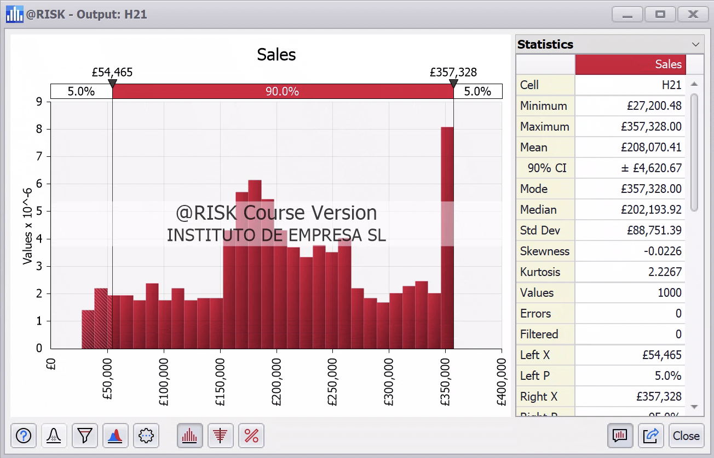
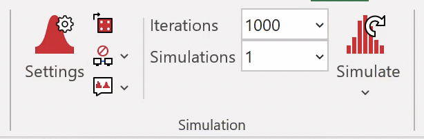
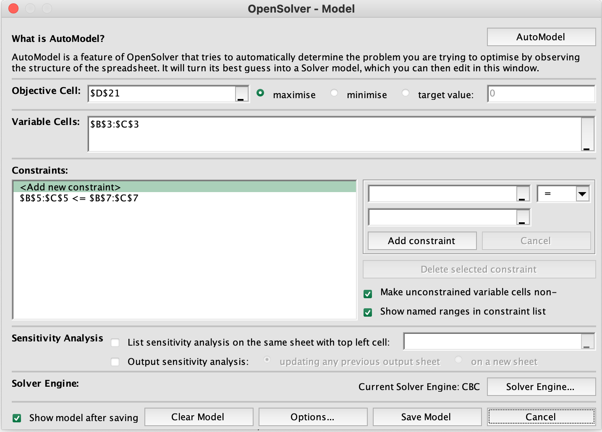
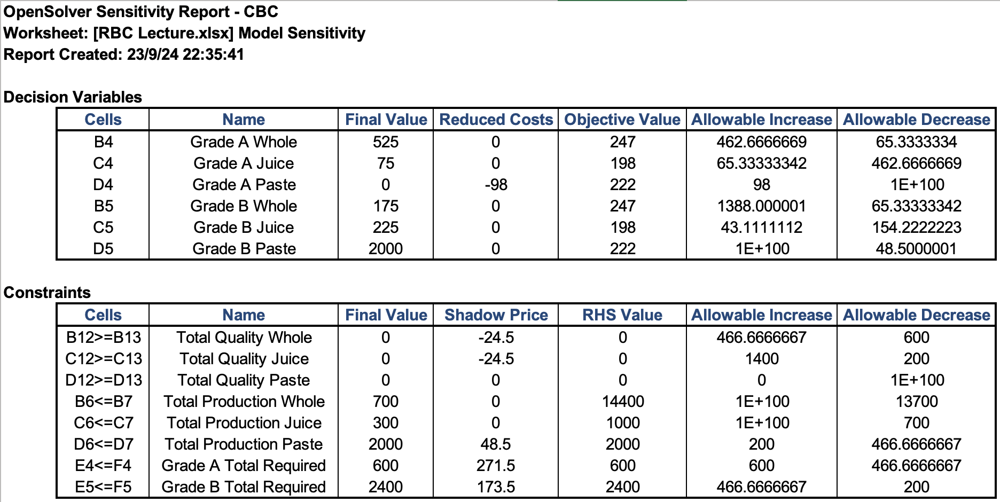

## Instructions

### Grading

You have until the end of the session to submit the exam. Per every minute that you submit late, you will lose 1 point.

### Answers

There is one and only one correct answer.

* Each correct answer is worth 1pt.

* Each incorrect answer is worth -0.5 pts.

* Each blank answer is worth 0 pts.

Each question refers (only) to the figures that are labelled accordingly. Some questions may refer to more than one figure.

### Question 1:

The plot below represents a sensitivity analysis of a dependent variable `Net Profit` versus two independent variables `Proportion of Supers(%)` and `Demand`.

The sensitivity of the `Net Profit` to `Demand` is...

(a) The Highest when the `Demand` is above `250000`

(b) Lower when the `Demand` is around `150000` than when `Demand` is around `250000`

(c) Equal to the sensitivity to `Proportion of Supers(%)`

(d) Higher when the `Demand` is around `150000` than when the `Demand` is around `50000`

### Question 2

The plot below shows the cumulative distribution function of the output variable of the profit of the Wellyntoy company.

Choose the correct statement:

(a) There is a 5% probability that the profit is £108,075

(b) There is a 70% probability that the profit is below 300,000 (approx.)

(c) There is a 90% probability that the profit is between 0 and £368,328

(d) There is a 30% probability that the profit is £225,000 (approx.)

### Question 3

Choose the correct statement:

(a) There is a 90% probability that the profit is £357,328

(b) There is a 5% probability that the profit is £54,465 or lower

(c) There is a 90% probability that the profit is either £54,465 or £357,328

(d) There is a 5% probability that the profit is £50,000 (approx.)

### Question 4

What does this imply?:

(a) Samples will be drawn from each random variable 1,000 times
(b) 1,000 Open Solver simulations will take place
(c) An Open Solver simulation will be run, featuring 1,000 draws from each input random variable
(d) A Monte Carlo simulation with 1,000 iterations will be run, each with 1,000 random variables  

### Question 5

Which one is correct?

(a) The model has two decision variables
(b) The model an equality as a constraint
(c) The model tries to maximize the error between cell D21 and the target value
(d) The model will produce a Sensitivity Analysis

### Question 6

Which one is false?

(a) The model has several sets of constraints
(b) The models assumes that this is a linear programming problem
(c) The model has several objective functions
(d) The model has nine decision variables

### Question 7

Which one is correct?

(a) The multiple-cell boxes highlight the decision variables
(b) The single-cell box highlights the decision variables
(c) The shades highlight the constraints
(d) The horizontal boxes highlight constraints

### Question 8

Which one is correct?

(a) The demand of whole tomatoes seems to be not binding
(b) The demand of juice seems to be not binding
(c) The available A tomatoes seems to be not binding
(d) The quality of whole tomatoes seems to be not binding

### Question 9

Choose the correct one (don't worry about the units or the converstion to 1,000s):

(a) Increasing the production of grade A tomatoes would bring a benefit of 600
(b) Increasing the production of grade A tomatoes would bring a benefit of 271.5 for at least 600 additional tomatoes
(c) Increasing the production of grade B tomatoes would bring a benefit of 2,400
(d) Increasing the production of grade B tomatoes would bring a benefit of 173.5 for at least 200 additional tomatoes

### Question 10

Which one is true?

(a) the $b$ coefficients are the decision variables
(b) Z is the objective function
(c) the $C$ coefficients are the Lagrange multipliers
(d) the $b$ coefficients are the shadow prices

### Question 11

Is the solution in the screenshot correct?

(a) Yes
(b) No
(c) I cannot tell from what is shown

### Question 12

Choose the correct one:

(a) If Y chips could work 220 hours instead of 200, there would be a benefit of 815 per extra hour compared to the base case

(b) If Y chips could work 210 hours instead of 200, there would be a benefit of 815 per extra hour compared to the base case

(c) If Y chips could work 180 hours instead of 200, there would be a loss of 8.14 per missing hour compared to the base case

(d) All the hours worked by Y chips up to 200 have brought an additional benefit of 815

### Question 13

Choose the correct one:

(a) If the demand for X401 were higher, profits would be higher than in the base case

(b) If the demand for X402 were 50,000, profits would increase by 28.3 per extra unit of demand (versus the base case)

(c) If the demand for X403 were 22,600, profits would decrease by 66.57 per missing unit of demand (versus the base case)

(d) If the total production were higher, profits would be higher than in the base case

### Question 14

How is the shortage calculated?

(a) It is equal to the sales minus the demand

(b) It is equal to the demand minus the sales

(c) It is the remainder of the production after subtracting inventory

(d) It is equal to the production, including outsourced, minus the demand

### Question 15

How are the sales calculated?

(a) They are equal to the production times the defective chips

(b) They are equal to the production times the yield (% of adequate chips)

(c) They are equal to the production minus the demand

(d) They are equal to the production minus the shortage

### Question 16

Assume we want to turn the demand of `X401` into a random variable and run a Monte Carlo simulation. Which cells would you define as inputs in `@RISK`?

(a) `E26`

(b) `E24:G24`

(c) `E24`

(d) `E24:E26`

### Question 17

Assume we want to turn the availability of Y chips into a random variable that is normally distributed and therefore defined by its mean and standard deviation. We know that it would be rare for Y chips to deliver less than 100 hours or more than 300 hours, but common for them to deliver 220 or 180 hours.

Which of the following would be a reasonable choice?

(a) $\mu$ = 720, $\sigma$ = 50

(b) $\mu$ = 200, $\sigma$ = 5

(c) $\mu$ = 200, $\sigma$ = 500

(d) $\mu$ = 200, $\sigma$ = 50

### Question 18

How do you calculate the `Sales` for the `Standard`?

(a) `=MIN(B5, B7)`

(a) `=MAX(B5, B7)`

(a) `=B5 - B7`

(a) `=B7 - B5`

### Question 19

Assume that you want to model the proportion of Super as a random variable. Which of the following distributions would make sense?

(a) A Pareto distribution

(b) A normal distribution with $\mu$ = 40%, $\sigma$ = 100%

(c) A normal distribution with $\mu$ = 40%, $\sigma$ = 1%

(d) A distribution bounded between $30\%$ and $60\%$

### Question 20

Which cell should we select as `Row input cell`?

(a) `D7`

(b) `C8`

(c) `C24:F24`

(d) `B25:B35`

### Question 21

When defining the data table, which cell should we select as `Column input cell`?

(a) `D7`

(b) `C8`

(c) `C24:F24`

(d) `B25:B35`

### Question 22

Which purpose does the data table serve?

(a) Illustrate the sensitivity of the optimal amount of `Super` toys for each level of the `Demand`

(b) Illustrate the sensitivity of the optimal amount of `Demand` for each level of `Super`

(c) Illustrate the sensitivity of the profit to both the `Super` toys and the `Demand`

(d) Illustrate the sensitivity of the optimal level of production for each profit level

### Question 23

Why do each of the four approaches yield different profits?

(a) Because each approach takes different random samples from the distributions

(b) Because the constraints are different in each approach

(c) Because OpenSolver is run separately for each approach

(d) Because each approach sets different production values

### Question 24

Do you think the approach of the Field Sales representative has been optimized with OpenSolver?

(a) No, because it does not comply with the demand constraint

(b) No, because it does not yield the same result as Gassman, who has used OpenSolver

(c) Yes, because the profit is lower and we want to minimize it

(d) No, because it incurs in capacity costs

### Question 25

Which of the following is correct?

(a) The Sales distribution has more upside potential and less downside risk than the Optimizer distribution

(b) The Sales distribution has more upside potential and more downside risk than the Optimizer distribution

(c) The Sales distribution has less upside potential and less downside risk than the Optimizer distribution

(d) The Sales distribution has less upside potential and more downside risk than the Optimizer distribution

### Question 26

Which of the following is correct?

(a) There is a 5% chance that the Sales distribution yields more than £264,000

(b) The most likely value of the Optimizer distribution is £357,328

(c) There is a 26.7% chance that the Sales distribution yields more than £264,000

(d) There is a 57.7% chance that the Sales distribution yields more profit than the Optimizer distribution

### Question 27

Which of the following is *not* correct?

(a) There is a 90% probability (approx.) that the profit is below £297,528

(b) There is a 70% probability (approx.) that the profit is below £290,000

(c) There is a 10% probability (approx.) that the profit is below £150,000

(d) There is a 30% probability (approx.) that the profit is below £230,000

### Question 28

Which of the following is *not* correct?

(a) The most frequent value of the distribution is £297,528

(b) The mean of the distribution is £243,534

(c) The standard deviation is greater than the mean

(d) £200,000 is below the first quartile

### Question 29

What happens if OpenSolver cannot find a feasible solution within the given constraints?

(a) OpenSolver will add an extra decision variable

(b) OpenSolver will adjust the constraints to fit the objective

(c) OpenSolver provides a message that no feasible solution exists and displays the closest approximation

(d) OpenSolver automatically changes the objective function to find an alternative solution

### Question 30

Which of the following is a key advantage of using Monte Carlo simulation over a deterministic model?

(a) It provides a single, optimal solution.

(b) It allows for consideration of the uncertainty in input variables.

(c)	It eliminates the need for sensitivity analysis.

(d)	It guarantees more accurate results than optimization methods.

### Question 31

In OpenSolver, which of the following is true?

(a)	The Simplex method is the best for non-linear problems

(b)	Linear problems with continuous variables have a unique solution

(c)	Linear problems with continuous variables have local optima

(d)	The constraints of a linear problem must be modelled with `@RISK`

### Question 32

Which of the following describes the use of scenario analysis (e.g. high/low demand for tomatoes)?

(a) A method to identify the single most likely outcome

(b)	A technique to explore different potential futures by adjusting a few key assumptions

(c)	An approach that eliminates the need for simulations entirely

(d)	A method for ensuring that only optimal outcomes are simulated

### Question 33

Why is sensitivity analysis important after solving an optimization problem in OpenSolver?

(a)	It helps identify the optimal solution

(b)	It ensures that the model constraints are correctly implemented

(c)	It shows how sensitive the solution is to changes in the input data

(d)	It guarantees that the solution will remain feasible if constraints change

### Question 34

What is the main output of a Monte Carlo simulation?

(a)	A single deterministic result.

(b)	The optimal solution for a given set of constraints.

(c)	A breakdown of the most frequent outcome.

(d)	A range of potential outcomes with associated probabilities.