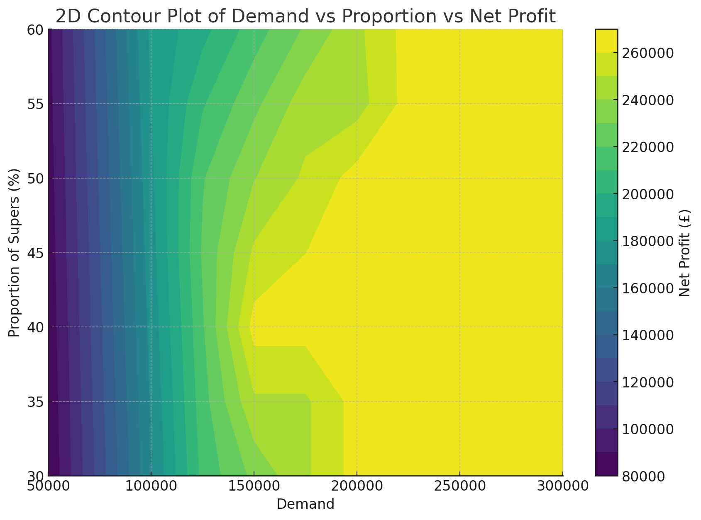
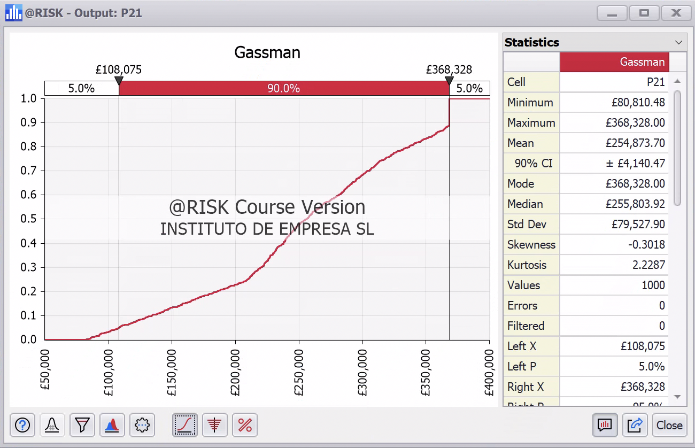
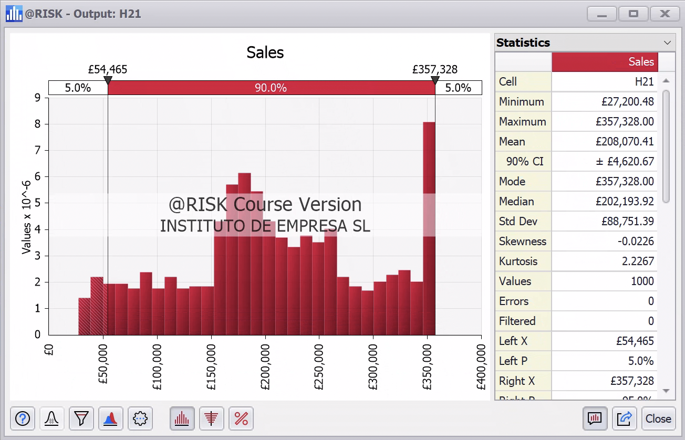
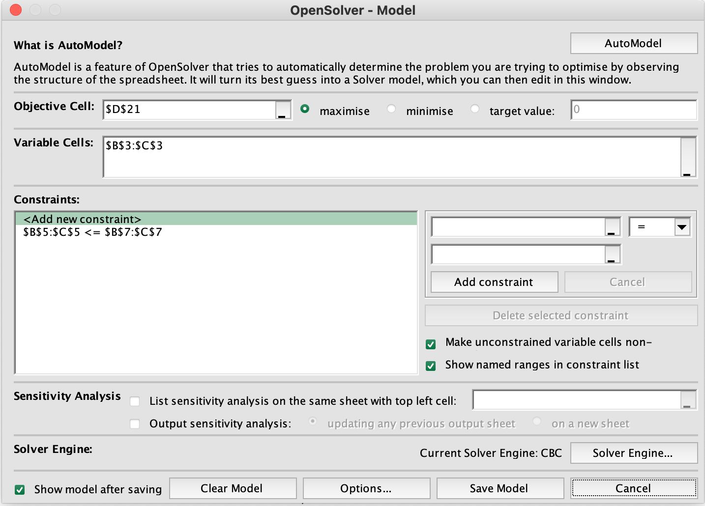
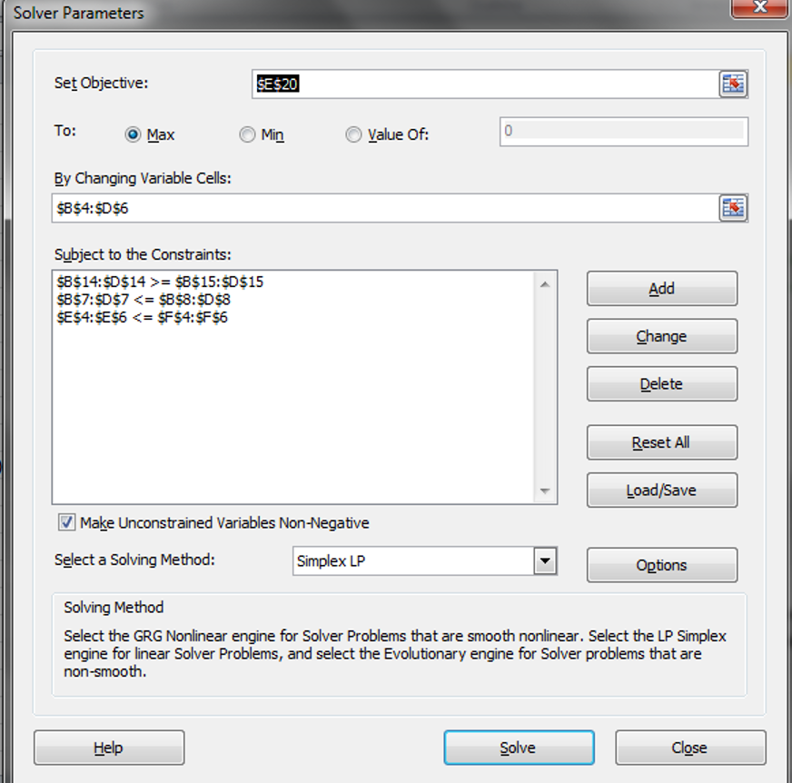
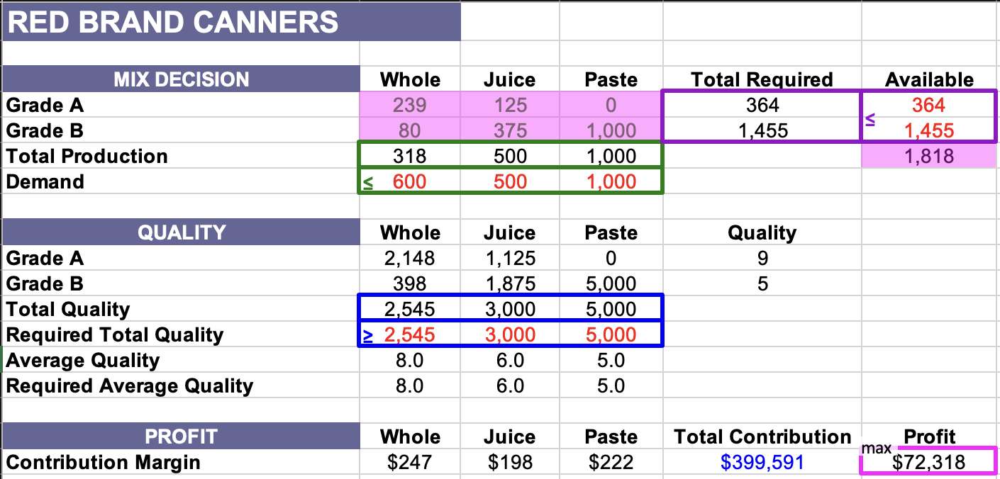
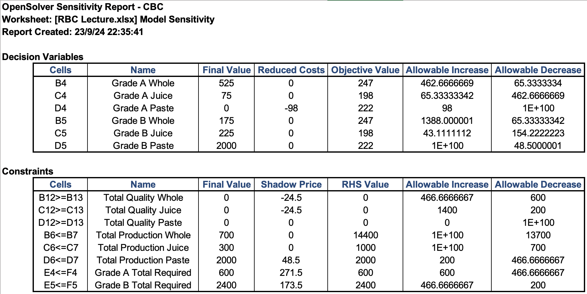
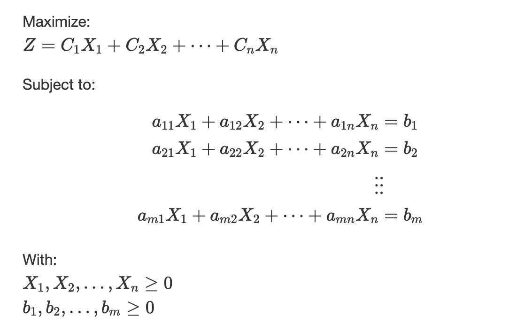

## Instruction

### Grading

This midterm is optional. Please put the following letter in the top right corner of your answer sheet:

* N: the grade of the midterm will not be considered
* Y: the grade of the midterm will be considered and will substitute the attendance grade

### Answers

There is one and only one correct answer. 

* Each correct answer is worth 1pt.

* Each incorrect answer is worth -0.5 pts.

* Each blank answer is worth 0 pts.

### Question 1:

The plot below represents a sensitivity analysis of a dependent variable `Net Profit` versus two independent variables `Proportion of Supers(%)` and `Demand`.

The sensitivity of the `Net Profit` to `Proportion of Supers(%)` is...

(a) Higher when the `Demand` is higher

(b) Lower when the `Demand` is around `150000` than when `Demand` is around `250000`

(c) Equal to the sensitivity to `Demand`

(d) Higher when the `Demand` is around `150000` than when the `Demand` is around `50000`

### Question 2

The plot below shows the cumulative distribution function of the output variable of the profit of the Wellyntoy company.

Choose the correct statement:

(a) There is a 90% probability that the profit is £328,328

(b) There is a 5% probability that the profit is between 0 and £108,075

(c) There is a 5% probability that the profit is below 0.9 (approx.)

(d) There is a 30% probability that the profit is £225,000 (approx.)

### Question 3

Choose the correct statement:

(a) There is a 90% probability that the profit is £357,328

(b) There is a 5% probability that the profit is £54,465

(c) There is a 90% probability that the profit is between £54,465 and £357,328

(d) There is a 5% probability that the profit is £50,000 (approx.)

### Question 4

What does this represent?:

(a) 1,000 Monte Carlo simulations
(b) A Monte Carlo simulation with 1,000 draws from each input random variable
(c) 1,000 iterations of a linear programming
(d) A Monte Carlo simulation with 1,000 iterations, each with 1,000 random variables  

### Question 5

Which one is correct?

(a) The model has several decision variables
(b) The model has a single constraint
(c) The model tries to maximize the error between cell D21 and the target value
(d) The model is not using Simplex as Solver 

### Question 6

Which one is false?

(a) The model has several sets of constraints
(b) The models assumes that this is a linear programming problem
(c) The model has several objective functions
(d) The model takes six decision variables

### Question 7

Which one is correct?

(a) The multiple-cell boxes highlight the decision variables
(b) The single-cell box highlights the decision variables
(c) The pink shades highlight the constraints
(d) The horizontal boxes highlight a constraint

### Question 8

Which one is correct?

(a) The demand of juice seems to be not binding
(b) The demand of whole tomatoes seems to be not binding
(c) The available A tomatoes seems to be not binding
(d) The quality of whole tomatoes seems to be not binding

### Question 9

Choose the correct one (don't worry about the units or the converstion to 1,000s):

(a) Increasing the production of grade A tomatoes would bring a benefit of 600
(b) Increasing the production of grade B tomatoes would bring a benefit of 2,400
(c) Increasing the production of grade A tomatoes would bring a benefit of 271.5 for at least 600 additional tomatoes
(d) Increasing the production of grade B tomatoes would bring a benefit of 173.5 for at least 200 additional tomatoes

### Question 10

Which one is false?

(a) the $b$ coefficients are the decision variables
(b) Z is the objective function
(c) the $a$ coefficients are part of the definition of the constraints
(d) the $b$ coefficients are the shadow prices