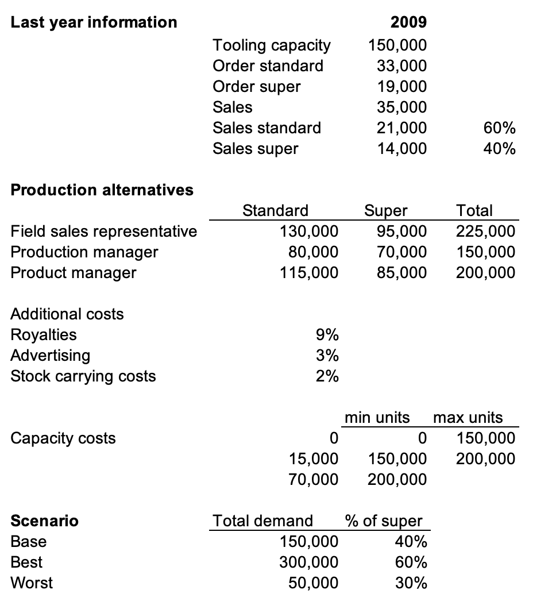

# Wellyntoy case

## Summary

### Business context

* Dynatron is originally a comic strip and then became a cartoon series

* Wellyntoy decided to produce a character toy based on Dynatron

* Injection moulded toy with moving parts that can become a racing car with few manipulations

* Two Dynatron types: standard and super
Different in size and finish

* Wellyntoy plans for 2010 learning from 2009

### Numbers from 2009:

* Tooling capacity: 150,000 units (£50,000)
* Order quantity: 33,000 standard and 19,000 super
* Sales: 35,000 units (60% standard and 40% super)
* Inventory leftover: 12,000 standard and 5,000 super (due to production delays)

### Situation for 2010:

* Demand: 150,000 units (min=50,000 units, max=300,000 units)
* Proportion of supers: 40% (min=30%, max=60%)

* Price for 2010: £4.30 standards, and £5.50 supers

* Cost estimates for 2010
* Capacity costs:
Tooling capacity from 2009 (150,000) is in good shape
£15,000 to increase tooling capacity anywhere between 150,000 and 200,000
£55,000+£15,000 to have capacity over 200,000
* Direct costs: £2.50 for standard and £3.20 for super.
* Selling, royalties, discounts: 9% of gross margin
* Advertising and promotion: 3% of gross margin
* Holding cost: 2% per month based on direct costs
Any excess stock is carried for an average of 6 months

