# Wellyntoy case

## Summary

### Business context

* Dynatron is originally a comic strip and then became a cartoon series

* Wellyntoy decided to produce a character toy based on Dynatron

* Injection moulded toy with moving parts that can become a racing car with few manipulations

* Two Dynatron types: standard and super
Different in size and finish

* Wellyntoy plans for 2010 learning from 2009

### Situation for 2009:

* Tooling capacity: 150,000 units (£50,000)
* Order quantity: 33,000 standard and 19,000 super
* Sales: 35,000 units (60% standard and 40% super)
* Inventory leftover: 12,000 standard and 5,000 super (due to production delays)

### Situation for 2010:

* Demand: 150,000 units (min=50,000 units, max=300,000 units)
* Proportion of supers: 40% (min=30%, max=60%)

* Price for 2010: £4.30 standards, and £5.50 supers

* Cost estimates for 2010
* Capacity costs:
Tooling capacity from 2009 (150,000) is in good shape
£15,000 to increase tooling capacity anywhere between 150,000 and 200,000
£55,000+£15,000 to have capacity over 200,000
* Direct costs: £2.50 for standard and £3.20 for super.
* Selling, royalties, discounts: 9% of gross margin
* Advertising and promotion: 3% of gross margin
* Holding cost: 2% per month based on direct costs
Any excess stock is carried for an average of 6 months

### Questions to solve

* Who are the main characters?
  * Danny Keepstone, Marketing Manager
  * Saul Gassman, Product Manager

* What is the main question?
  * How many Dynatron to produce for Autumn 2010? 

* Three different production alternatives

  * Produce 130,000 standards and 95,000 supers (field sales representatives)
  * Produce 80,000 standards and 70,000 supers (production manager)
  * Produce 115,000 standards and 85,000 supers (Gassman, product manager)

* When must be the decision made?
  * By the end of March 2010 (6 months before)

### Profit and loss

$\text{Net Profit} = \text{Gross Margin} - \text{Additional Expenses} - \text{Inventory Carrying Costs} - \text{Capacity Costs}$

$\text{Gross Margin} = (\text{Price}_{st} - \text{Direct Cost}_{st}) \times \text{Sales}_{st} + (\text{Price}_{sup} - \text{Direct Cost}_{sup}) \times \text{Sales}_{sup}$

$\text{Additional Expenses} = 12\% \times \text{Gross Margin}$

$12\% = 9\% \text{ (royalties, etc)} + 3\% \text{ (advertising, etc.)}$

$\text{Sales}_{st} = \min(\text{Demand}_{st}, \text{Avail. Inventory}_{st})$

$\text{Avail. Inventory}_{st} = \text{Leftover09}_{st} + \text{Production}_{st}$

$
\text{Inventory Carrying Costs} = 2\% \times £2.5 \times \text{Leftover}_{10_{st}} \times 6 + 2\% \times £3.20 \times \text{Leftover}_{10_{sup}} \times 6
$

| Total Production                       | Capacity Costs (£) |
|----------------------------------------|-------------------|
| $≤ 150,000$                              | 0                 |
| $150,000 < Total Production ≤ 200,000$   | 15,000            |
| $> 200,000$                              | 70,000            |

## Building up the models

### Sensitivity to one variable

We can assess the impact of different demand scenarios while keep the optimization as per the base case.

| % of Supers | Net Profit    |
|-------------|---------------|
| 30%         | £227,880      |
| 35%         | £245,940      |
| 40%         | £264,000      |
| 45%         | £249,870      |
| 50%         | £235,740      |
| 55%         | £221,610      |
| 60%         | £207,480      |

| Demand  | Net Profit    |
|---------|---------------|
| 50,000  | £54,640       |
| 75,000  | £106,980      |
| 100,000 | £159,320      |
| 125,000 | £211,660      |
| 150,000 | £264,000      |
| 175,000 | £264,000      |
| 200,000 | £264,000      |
| 225,000 | £264,000      |
| 250,000 | £264,000      |
| 275,000 | £264,000      |
| 300,000 | £264,000      |

### Sensitivity to two variables

We can explore what would happen if the share of "super" and the total demand changed in an orthogonal way. For that, we will build an Excel data table:

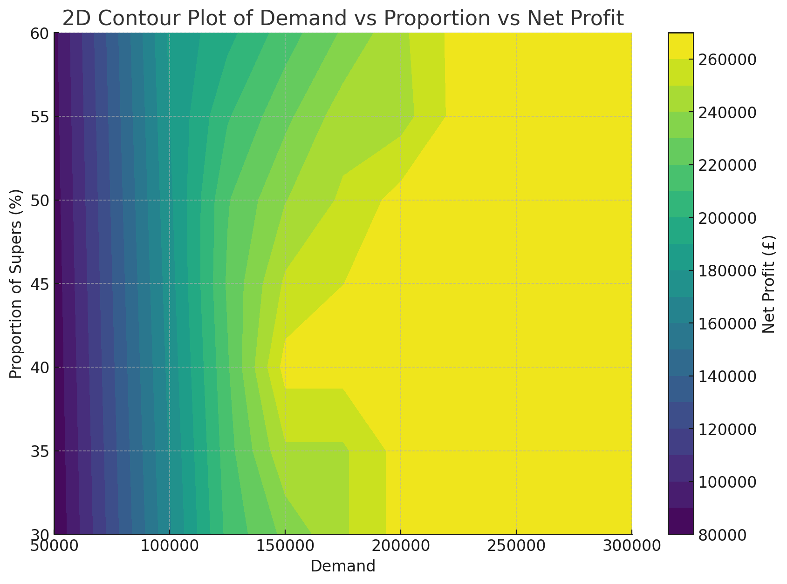

Data tables are a fantastic tool to deal with uncertainty in one or two variables, so it is strongly recommended that you spend time getting familiar with them.

### Production Alternatives

- **Field Sales Representative**
  - Want to sell more because the wage is commission-based
  - Standard: 130,000 units
  - Super: 95,000 units

- **Production Manager**
  - Realistic and sometimes pessimistic
  - Standard: 80,000 units
  - Super: 70,000 units

- **Product Manager (Gassman)**
  - Compromise in the middle
  - Standard: 115,000 units
  - Super: 85,000 units

- **Which alternative is better?**

In order to answer this question we need to think of the uncertainties as random variables.

## `@RISK`

### Modelling the Demand as a Random Variable

The cumulative distribution function of the demand is defined in the case as follows:

- **expected**: 150,000
- **minimum**: 50,000
- **3 chances in 4** of demand being higher than 125,000
- **1 chance in 4** of demand being higher than 190,000
- **maximum**: 300,000

We can rephrase in mathematical terms as follows:

| Percentile    | Demand    |
|---------------|-----------|
| 0% (minimum)  | 50,000    |
| 25% percentile| 125,000   |
| 50% (median)  | 150,000   |
| 75% percentile| 190,000   |
| 100% (maximum)| 300,000   |

With `@RISK` we can define this CDF in Excel as follows:

`=RiskCumul(50K,300K,{125K,150K,190K},{0.25,0.5,0.75})`

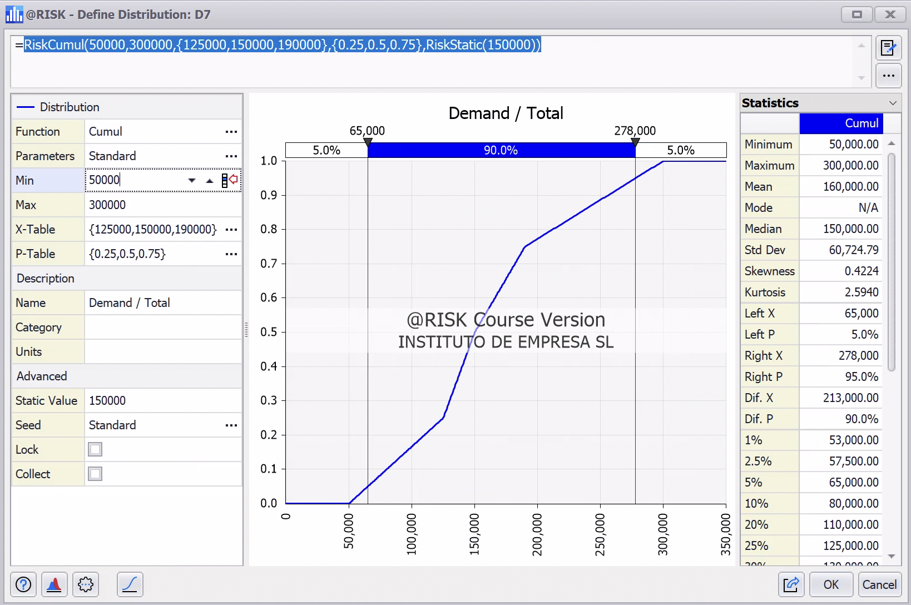

### Modelling the proportion of super as a random variable

The cumulative distribution function of the proportion of super is defined in the case as follows:

* *50-50* chance of 40% demand for Super model
* *maximum*: 60%
* *minimum*: 30%
* *75%* chance less than 45%
* *25%* chance less than 36%

| Percentile    | Proportion of super    |
|---------------|-----------|
| 0% (minimum)  | 30% |
| 25% percentile| 36% |
| 50% (median)  | 40% |
| 75% percentile| 45% |
| 100% (maximum)| 60% |

With `@RISK` we can define this CDF in Excel as follows:

`=RiskCumul(0.3,0.6,{0.36,0.4,0.45},{0.25,0.5,0.75})`

### Modelling the output

We need to select which cell we want to consider as output for visualization and analysis purposes.

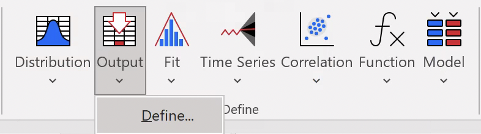

In sum, three of the cells in our model include an `=RISK()` expression.

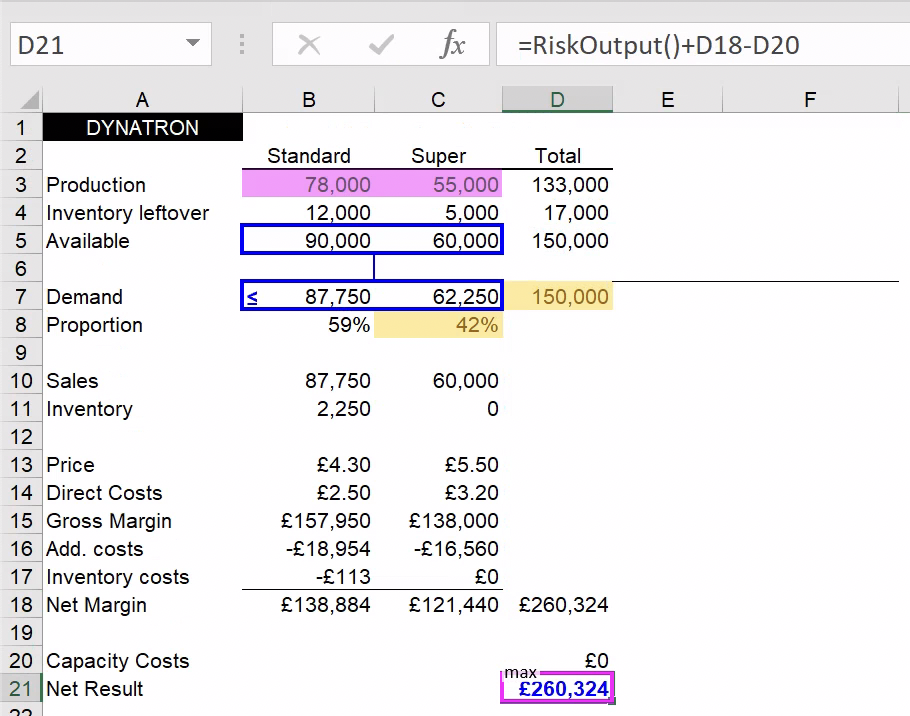

### Running the simulation

[See figures]

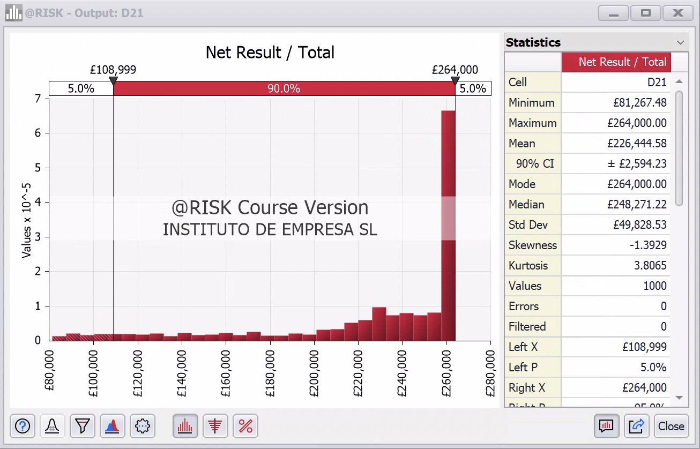

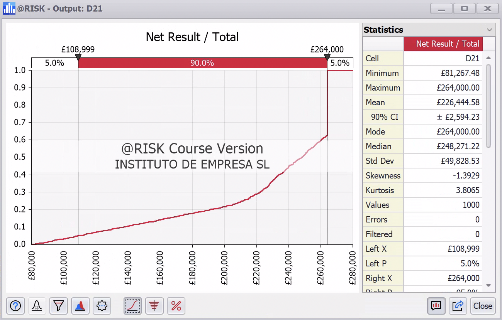

## Production alternatives

In the case, three different people have three different approaches to the production decision. How these approaches will fare will depend on the demand and the proportion of super toys. In order to have an holistic assessment, we can run the simulation for the three approaches plus our original "optimized" approach. Let's take a look at the results.

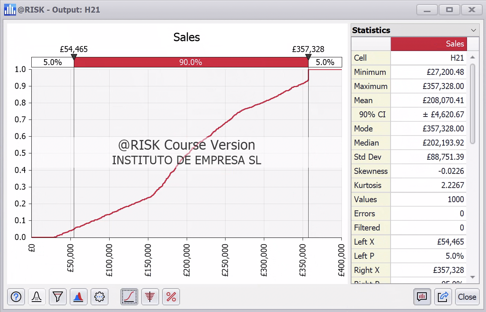

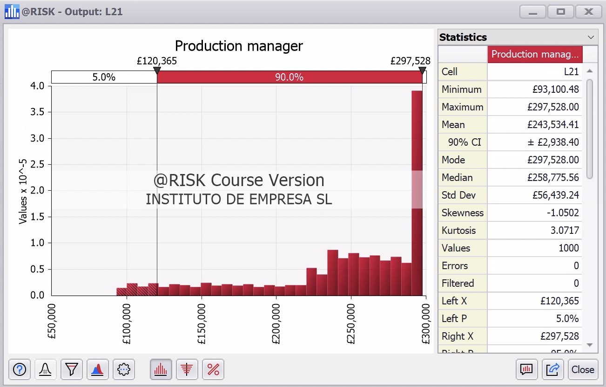

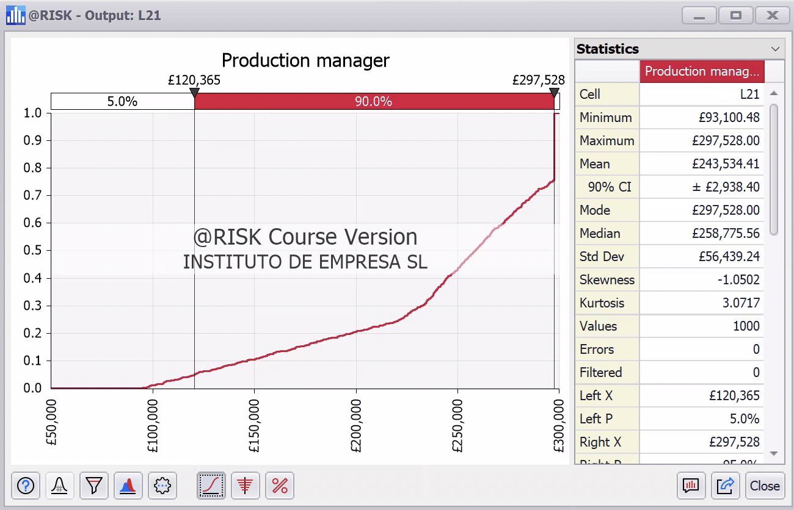

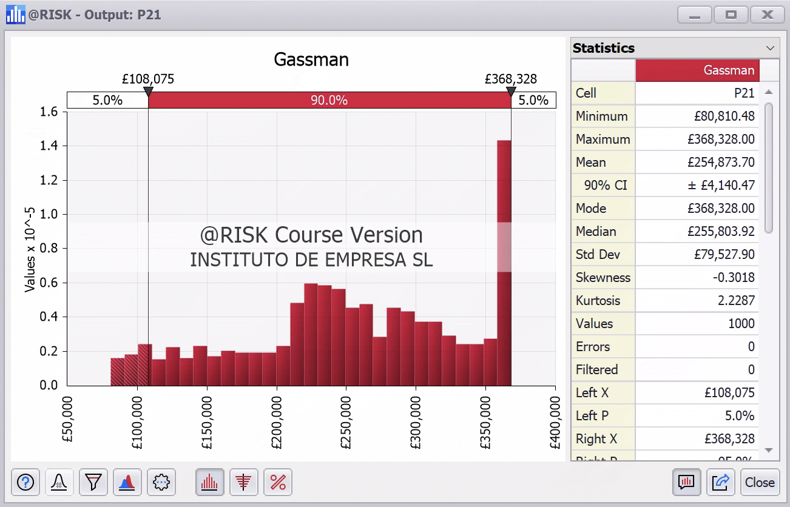

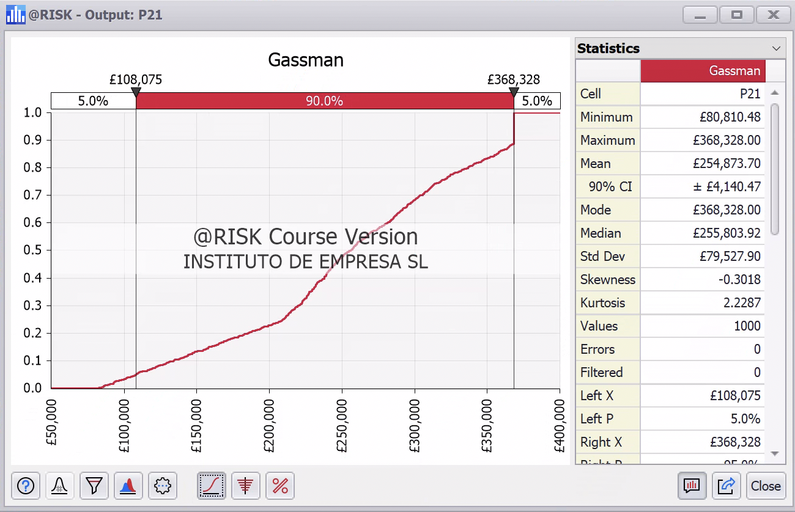

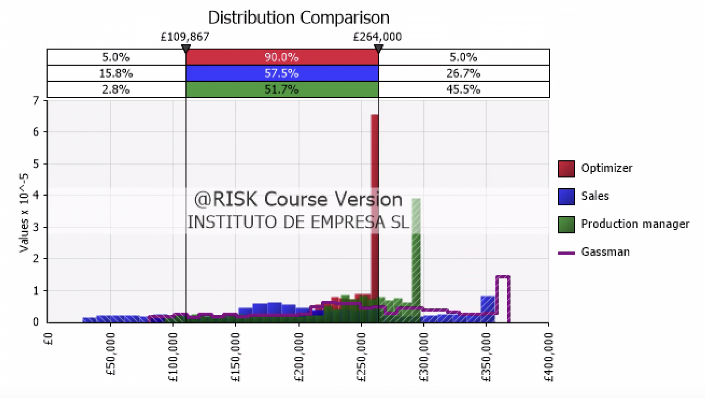