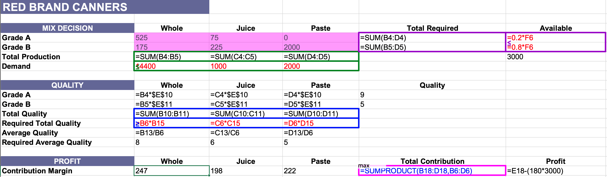
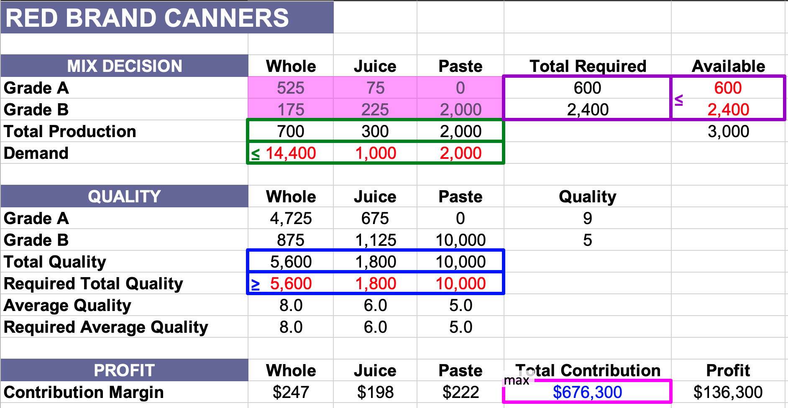
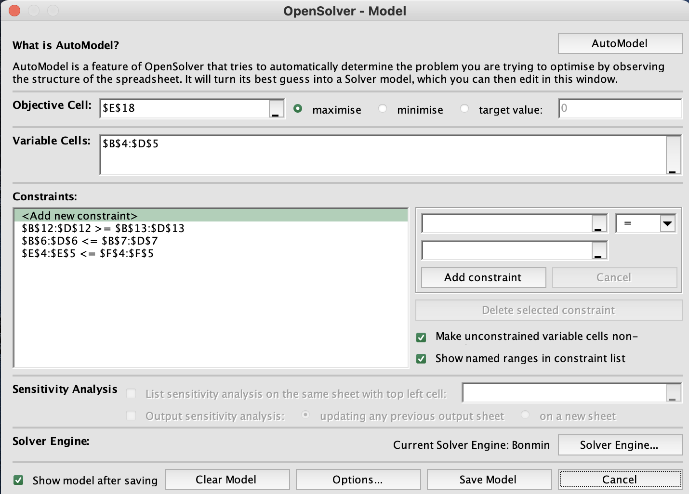

# Summary

## Background

Red Brand Canners, a medium-sized company in the US, specializes in canning and distributing fruit and vegetable products under private labels. In September 2015, the company’s VP of Operations, Mitchell Gordon, convened a meeting to discuss the amount of tomato products to pack for the upcoming season. The tomato crop was already arriving, and production had to begin immediately to avoid spoilage.

## Key Stakeholders

- **Mitchell Gordon** - Vice President of Operations
- **William Cooper** - Controller
- **Charles Myers** - Sales Manager
- **Dan Tucker** - Production Manager

## Situation

The incoming tomato crop included:

- 3,000,000 lbs of tomatoes, with 20% being Grade "A" and 80% being Grade "B".
- The company needed to decide on the allocation of tomatoes for different products based on demand forecasts and profitability.

## Product and Demand Forecast

The key tomato-based products include:

- **Whole tomatoes**: Demand forecast - 800,000 cases, selling price - $12.00 per case.
- **Tomato juice**: Demand forecast - 50,000 cases, selling price - $13.50 per case.
- **Tomato paste**: Demand forecast - 80,000 cases, selling price - $11.40 per case.

## Key Insights

1. **Product Profitability**:
   - William Cooper’s analysis indicated whole tomatoes had the highest incremental profit.
   - Charles Myers presented an alternative marginal cost analysis, recommending using 2,000,000 lbs of "B" tomatoes for paste and the remaining tomatoes for juice, yielding a potential $144,000 profit.

2. **Constraints**:
   - Whole tomatoes require Grade “A” quality, limiting production to 800,000 lbs due to quality restrictions.
   - Tomato paste can be made entirely from Grade “B” tomatoes.

## Conclusion

The stakeholders had different views on maximizing profitability:

- **William Cooper** focused on whole tomatoes.
- **Charles Myers** proposed a more nuanced allocation based on tomato quality, with higher emphasis on tomato paste production.

## Key Questions

1. Is Mr. Cooper’s reasoning on whole tomatoes being the most profitable correct?
2. How did Mr. Tucker calculate the limit for whole tomato production?
3. Is Mr. Myers' analysis of tomato costs valid?
4. Should the company follow Myers' recommendation for tomato allocation?
5. Should the company purchase the additional Grade “A” tomatoes offered at 25.5 cents per pound?

# Analysis

## Supply and Demand

### Supply (Dan Tucker)

- **Quantity**: 3,000K pounds (lb)
- **Quality**: 20% Grade A, 80% Grade B
- **Price**: 18 cents per pound

### Demand Forecasts (Charles Myers)

- **Selling prices** are set in light of the long-term marketing strategy of the company, and potential sales are forecast at these prices.
- **Whole tomatoes**: We can sell all the whole tomatoes we can produce (3,000K lbs < 18 * 800K cases = 14,400K lbs).
- **Tomato juice and paste**: Demand is limited.

#### Exhibit 1. Demand Forecasts

| Product          | Selling Price (per case) | Demand Forecast (cases) | Pounds (per case) |
|------------------|--------------------------|-------------------------|-------------------|
| Whole tomatoes   | $12.00                   | 800,000                 | 18                |
| Tomato juice     | $13.50                   | 50,000                  | 20                |
| Tomato paste     | $11.40                   | 80,000                  | 25                |

## Quality Constraint

- Cannot produce all whole tomatoes.

- **Quality rating** is between 0 (lowest) and 10 (highest).

- **Grade A tomatoes**: Average quality rating of 9.
- **Grade B tomatoes**: Average quality rating of 5.

- **Minimum quality ratings** required:
  - Whole tomatoes > 8 points per pound.
  - Tomato juice > 6 points per pound.
  - Tomato paste > 5 points per pound.

## Profit Contributions

- **Fruit Costs** = Pounds per case × 18 cents

#### Exhibit 2. Product Item Profitability (per case)

| Product         | Whole Tomatoes | Tomato Juice | Tomato Paste |
|-----------------|----------------|--------------|--------------|
| **Selling Price**            | $12.00         | $13.50       | $11.40       |
| **Direct labour**            | $3.54          | $3.96        | $1.62        |
| **Variable overhead**        | $0.72          | $1.08        | $0.78        |
| **Variable selling**         | $1.20          | $2.55        | $1.14        |
| **Packaging material**       | $2.10          | $1.95        | $2.31        |
| **Fruit**                    | $3.24 = 18 × 0.18 | $3.60 = 20 × 0.18 | $4.50 = 25 × 0.18 |
| **Total Variable Costs**     | $10.80         | $13.14       | $10.35       |
| **Contribution**             | $1.20          | $0.36        | $1.05        |
| **Allocated Overhead**       | $0.84          | $0.63        | $0.69        |
| **Net Profit**               | $0.36          | -$0.27       | $0.36        |

## Cooper's Solution

- **Highest incremental profits** belong to whole tomatoes.
- **Produce only whole tomatoes** (3,000K lbs) since there is enough demand.

## Tucker's Solution

- Whole tomato production is limited by 800K lbs.
- Let **y** represent whole tomato production (in 1,000 pounds).

- **Use 600K Grade A tomatoes** and the rest Grade B:

  $9 \times 600 + 5 \times (y - 600) \geq 8y$

  $5,400 + 5y - 3,000 \geq 8y$

  $2,400 \geq 3y$

  $y \leq 800$

- **Conclusion**: Produce 800K whole tomatoes, and use the rest of the Grade B tomatoes for paste.

## Myer's Solution

- **Fruit costs should be allocated based on quantity and quality**:

  - Consider quality point as a product.

  - Available quality points:

    $9 \times 600K + 5 \times 2,400K = 17,400K$

  - Cost per quality point:
    $\frac{3,000K \times 18 \text{ cents}}{17,400K} = 3.1 \text{ cents per quality point}$
  
- **Revised production costs**:

  - Grade A: $9 \times 3.1 = 27.9$ cents per pound.

  - Grade B: $5 \times 3.1 = 15.5$ cents per pound.

- **Revised fruit costs per case**:

  - Whole tomato: $18 \times 8 \times 0.031 = 4.47$ per case.

  - Tomato juice: $20 \times 6 \times 0.031 = 3.72$ per case.

  - Tomato paste: $25 \times 5 \times 0.031 = 3.90$ per case.

- **Produce as much tomato paste as possible, then produce tomato juice**:

  - Total tomato paste:

    $2000K \, \text{Grade B} / 25 = 80K \, \text{cases}$

  - Total tomato juice:

    $(600K \, \text{Grade A} + 400K \, \text{Grade B}) / 20 = 50K \, \text{cases}$

### Exhibit 3. Myer's Marginal Profit Analysis of Tomato Products (per case)

| Product            | Whole Tomatoes (\$) | Tomato Juice (\$) | Tomato Paste (\$) |
|--------------------|--------------------|------------------|------------------|
| **Selling Price**                       | 12.00            | 13.50            | 11.40            |
| **Variable Costs (excluding tomato cost)** | 7.56            | 9.54             | 5.85             |
| **Contribution (excluding tomato cost)**  | 4.44            | 3.96             | 5.55             |
| **Tomato Cost**                           | 4.47            | 3.72             | 3.90             |
| **Marginal Contribution**                 | -0.03           | 0.24             | 1.65             |

## Summary of Solutions

| Solution          | Tomato Type | Whole Tomato (pounds) | Tomato Juice (pounds) | Tomato Paste (pounds) | Contribution  |
|-------------------|-------------|-----------------------|-----------------------|-----------------------|---------------|
| **Tucker's Solution** | Grade A     | 600K                 | 0                     | 0                     | $641,600      |
|                   | Grade B     | 200K                 | 0                     | 2,000K                |               |
| **Myer's Solution**  | Grade A     | 0                    | 600K                  | 0                     | $642,000      |
|                   | Grade B     | 0                    | 400K                  | 2,000K                |               |

## Solutions

- All three solutions are wrong since they all consider sunk costs (i.e., fruit cost)
- Additionally, they optimize just one aspect of the problem while disregarding others

## What is the problem with Cooper’s solution?

- Considers the **sunk costs** (i.e., fruit and allocated overhead costs).
- **Infeasible** since it violates the quality requirement:
  - Total quality used is less than required.
  - $9 \times 600K + 5 \times 2,400K = 17,400K < 8 \times 3,000K = 24,000K$

## What is the problem with Tucker’s solution?

- Considers the **sunk costs** (i.e., fruit and allocated overhead costs).

## What is the problem with Myer’s solution?

- Considers the **sunk costs** (i.e., fruit costs) for his calculations.

## Revised Contributions

### Contribution Analysis

| Product          | Whole Tomatoes | Tomato Juice | Tomato Paste |
|------------------|----------------|--------------|--------------|
| **Selling Price** | $12.00         | $13.50       | $11.40       |
| **Direct Labour** | $3.54          | $3.96        | $1.62        |
| **Variable Overhead** | $0.72       | $1.08        | $0.78        |
| **Variable Selling** | $1.20        | $2.55        | $1.14        |
| **Packaging Material** | $2.10      | $1.95        | $2.31        |
| **Fruit**         | $3.24          | $3.60        | $4.50        |
| **Total Variable Costs** | $10.80   | $13.14       | $10.35       |
| **Contribution**  | $1.20          | $0.36        | $1.05        |
| **Allocated Overhead** | $0.84      | $0.63        | $0.69        |
| **Net Profit**    | $0.36          | -$0.27       | $0.36        |

### Pounds per Case

| Product          | Pounds per Case |
|------------------|-----------------|
| Whole Tomatoes   | 18              |
| Tomato Juice     | 20              |
| Tomato Paste     | 25              |

### Contribution per Pound and per 1000 Pounds

| Product          | Contribution (per case) | Contribution per lb. | Contribution per 1000 lbs. |
|------------------|-------------------------|----------------------|----------------------------|
| Whole Tomatoes   | $4.44                   | $0.247               | $247                       |
| Tomato Juice     | $3.96                   | $0.198               | $198                       |
| Tomato Paste     | $5.55                   | $0.222               | $222                       |

The contribution per pound will be included in the Excel.

## Decision Variables

How much of Grade A and B tomatoes to be used to produce whole tomatoes, tomato juice, and tomato paste?

### Grade A Tomatoes ($X_A$)

- **Whole Tomatoes**: $X_{AW}$
- **Tomato Juice**: $X_{AJ}$
- **Tomato Paste**: $X_{AP}$

### Grade B Tomatoes ($X_B$)

- **Whole Tomatoes**: $X_{BW}$
- **Tomato Juice**: $X_{BJ}$
- **Tomato Paste**: $X_{BP}$

## What is RBC’s objective?

$\text{Contribution} = \text{Contr}_{WT} + \text{Contr}_{TJ} + \text{Contr}_{TP}$

- **$Contr_{WT}$** (Whole Tomatoes Contribution):

$\text{Contr}_{WT} = 247 \times (X_{AW} + X_{BW})$
  
- **$Contr_{TJ}$** (Tomato Juice Contribution):

$\text{Contr}_{TJ} = 198 \times (X_{AJ} + X_{BJ})$

- **$Contr_{TP}$** (Tomato Paste Contribution):

$\text{Contr}_{TP} = 222 \times (X_{AP} + X_{BP})$

**Note**: Net contribution is calculated per 1,000 pounds.

## Constraints

- **Total Grade A and B tomato crop used** should be less than or equal to the available supply:

  $X_{AW} + X_{AJ} + X_{AP} \leq 600K$

  $X_{BW} + X_{BJ} + X_{BP} \leq 2,400K$

- **Total production of each product type** should be less than or equal to the demand for it:

  $X_{AW} + X_{BW} \leq 18 \times 800K = 14,400K$

  $X_{AJ} + X_{BJ} \leq 20 \times 50K = 1,000K$

  $X_{AP} + X_{BP} \leq 25 \times 80K = 2,000K$

- **Weighted average of quality points** for each tomato product should be greater than or equal to the quality requirement for it:

  $9 \times X_{AW} + 5 \times X_{BW} \geq 8 \times (X_{AW} + X_{BW})$

  $9 \times X_{AJ} + 5 \times X_{BJ} \geq 6 \times (X_{AJ} + X_{BJ})$

  $9 \times X_{AP} + 5 \times X_{BP} \geq 5 \times (X_{AP} + X_{BP})$

- **Production must be nonnegative**:

  $X_{AW}, X_{AJ}, X_{AP}, X_{BW}, X_{BJ}, X_{BP} \geq 0$

  ## Using Excel Solver

  

  

  

  # Summary of Solutions

| Solution         | Tomato Type | Whole Tomato (pounds) | Tomato Juice (pounds) | Tomato Paste (pounds) | Contribution |
|------------------|-------------|-----------------------|-----------------------|-----------------------|--------------|
| **Tucker’s Solution** | Grade A     | 600K                 | 0                     | 0                     | $641,600     |
|                  | Grade B     | 200K                 | 0                     | 2,000K                |              |
| **Myer’s Solution**  | Grade A     | 0                    | 600K                  | 0                     | $642,000     |
|                  | Grade B     | 0                    | 400K                  | 2,000K                |              |
| **Optimal Solution** | Grade A     | 525K                 | 75K                   | 0                     | $676,300     |
|                  | Grade B     | 175K                 | 225K                  | 2,000K                |              |

**Note**: The **Optimal Solution** improves contribution by 5%.