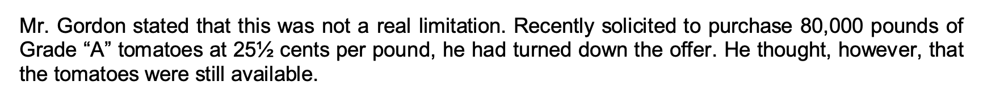

# Shadow prices

## Definition

### Shadow Prices in Linear Programming

In linear programming (LP), **shadow prices** represent the marginal value of relaxing a constraint. More specifically, the shadow price of a constraint is the amount by which the optimal value of the objective function would improve if the right-hand side of that constraint were increased by one unit, assuming all other factors remain constant.

Shadow prices are only valid within certain ranges, known as the **allowable range** for the constraint. If a constraint is not binding in the optimal solution (i.e., it has slack), its shadow price is typically zero, since relaxing it further has no effect on the objective.

**Key Points:**
- Shadow prices indicate the worth of an additional unit of a constrained resource.
- They are directly tied to binding constraints in the optimal solution.
- Useful for sensitivity analysis and understanding the value of limited resources.

In summary, shadow prices provide insight into the economic trade-offs within an LP model, helping to identify how much the objective can improve by relaxing resource constraints.

### Shadow Prices and Lagrange Multipliers in Linear Programming

In linear programming (LP), **shadow prices** are closely related to **Lagrange multipliers**, which arise in constrained optimization problems.

#### Lagrange Multipliers and LP

Consider a standard LP problem:

$\text{Maximize (or Minimize)} \quad c^T x$

$\text{Subject to:} \quad A x \leq b$

$x \geq 0$

Where:
- $x$ is the vector of decision variables,
- $c$ is the coefficient vector in the objective function,
- $A$ is the matrix of constraint coefficients, and
- $b$ is the vector representing the right-hand side of the constraints.

To solve this using Lagrange multipliers, we introduce a vector $\lambda$, where each $\lambda_i$ is the Lagrange multiplier (or **dual variable**) associated with the $i^{th}$ constraint. These dual variables represent the **rate of change of the objective function** with respect to the right-hand side of the corresponding constraint, effectively measuring how sensitive the objective function is to small changes in the resource availability.

#### Shadow Prices as Lagrange Multipliers

The shadow price of a constraint in LP corresponds to the value of the associated **Lagrange multiplier** at the optimal solution. Mathematically, for each binding constraint $A_i x = b_i$, the Lagrange multiplier $\lambda_i$ provides the shadow price, indicating how much the objective function will improve per unit increase in $b_i$.

Thus, in the optimal solution:
- $\lambda_i > 0$ for binding constraints (i.e., constraints that are tight and fully utilized),
- $\lambda_i = 0$ for non-binding constraints (i.e., constraints with slack).

This means:
- For a binding constraint, an increase in the available resource (e.g., increasing $b_i$ will result in an improvement in the objective function, with the rate of improvement given by $\lambda_i$, the shadow price.
- For a non-binding constraint, increasing the resource does not improve the objective function, hence the shadow price is zero.

#### Mathematical Interpretation

The optimal solution can be found by solving the **Lagrangian function**:

$\mathcal{L}(x, \lambda) = c^T x + \lambda^T (b - A x)$

The Lagrange multipliers $\lambda$ are determined as part of the optimization process, and these multipliers are precisely the **shadow prices**.

**In Summary:**
- Shadow prices in LP represent Lagrange multipliers in the dual problem.
- These multipliers reflect the marginal value of increasing the right-hand side of a constraint.
- Shadow prices are non-zero for binding constraints and zero for non-binding ones, indicating whether a resource is fully utilized or has slack.

By linking shadow prices to Lagrange multipliers, we can better understand how small changes in constraints impact the optimal solution in both linear and nonlinear optimization contexts.

## Application to the case

### Execution

An inequality constraint is binding if the solution makes it an equality. Otherwise it is nonbinding, and the positive difference between the two sides of the constraint is called slack.

In order to run sensitivity analysis we need to make sure we are using a linear solver, so please select "COIN-OR CBC" as solver.

Note that we will need to "ignore the integer constraints", because sensitivity analysis requires continuous variables. This is not a problem in this problem because cans are almost continuous (one extra can does not move the needle).

### Insights

* The constraint Total Grade A tomatoes required is equal to  271.5 with an allowable increase equal to 600.

* How much should RBC be willing to pay for one additional A tomato? Should they buy the additional A tomatoes at 25.5 cents?

* They should be willing to pay up to 27.15 cents.

* Yes they should buy all 80k additional A tomatoes at 25.5 cents since the price is lower than the shadow price (27.15 cents) and 80 is less than the allowable increase (600).  

* Bear in mind that we working in 1000s!

# Scenario analysis

## Premise

**Scenario analysis** is a strategic planning tool used to evaluate the potential outcomes of different future events by analyzing various possible scenarios. It involves developing and examining multiple, distinct "what-if" situations to understand the impact of uncertainties on decision-making.

This method is commonly used in finance, business strategy, and risk management to:

- Assess how different external factors, such as market shifts or regulatory changes, might influence key outcomes.

- Prepare for extreme cases (best-case, worst-case, and baseline scenarios).

- Identify potential risks and opportunities under various conditions.

Scenario analysis helps organizations make informed decisions by considering a range of future possibilities rather than relying on a single forecast.

## Application to the case

### Accurate forecasts

Let's work with a small variation on the actual case:

Suppose today is May 1st, so RBC has to determine how much tomato crop to purchase first and then allocates Grade A and B tomatoes across tomato products for next year. Fruit costs per pound are 18 cents

Everything else is the same but the demand can be either high or low

| Scenario | Probability | Whole Tomato (lbs) | Tomato Juice (lbs) | Tomato Paste (lbs) |
|----------|-------------|--------------------|--------------------|--------------------|
| High     | 80%         | 14,400K            | 1,000K             | 2,000K             |
| Low      | 20%         | 600K               | 500K               | 1,000K             |

Let's start with the high demand scenario. We need to make a few adjustments in our model:

* We need to maximize profit, not just total contribution
* The profit now depends on the total production
* The total production has become a decision variable

With that in mind, we can adjust and rerun out model:

We can then proceed with the low demand scenario, which is identical in construction and changes only in the values of the demand constraints.

### Underforecast or overforecast

What happens when we err in our forecast? There are two types of mistakes we can make.

First, let's assume that the order for tomato crop is determined assuming the demand state will be high, but the actual demand state turns out to be low, i.e. we overestimate demand.

* The total production becomes "fixed" by the time we can optimize, so it is no longer a decision variable
* The demand constraint needs to be updates
* We can still optimize the allocation of tomatoes into _whole_, _juice_, and _paste_

As we see in the picture, despite still having some room to manoeuver we cannot avoid losses.

The other type of mistake we can make is to order tomatoes assuming low demand, and then discovering that the demand is actually high.

After updating our model analogously we arrive to the results in the figure below.

### Summary of scenarios

In conclusion, we have four scenarios, two in which we accurately predict demand and two in which we don't. This is illustrated in the table below:

| Decision | Tomato Crop | Profit High (80%) | Profit Low (20%)  |
|----------|-------------|-------------------|-------------------|
| Optimal for High | 3,636,364 | $144,636 | -$185,345 |
| Optimal for Low | 1,818,182 | $88,485 | $72,318 |

### Maximizing average profit

Based on the learnings from the last section, we may want to be cautious and maximize for the whole instead of relying in our forecast abilities. To do that, we can run our optimizer taking into consideration the weighted probability of both scenarios simultaneously.

The model will now include the decision variables in both scenarios, as well as the constraints in both scenarios. The total crop will be common, and the profit will be the expected value of the profit in both scenarios.

| Decision | Tomato Crop | Profit High (80%) | Profit Low (20%)  |
|----------|-------------|-------------------|-----------------|
| Optimal for High | 3,636,364 | $144,636 | -$185,345 |
| Optimal for Low | 1,818,182 | $88,485  | $72,318 |
| Optimal for Expected Value | 2,727,272 | $132,727 | -$31,439 |
