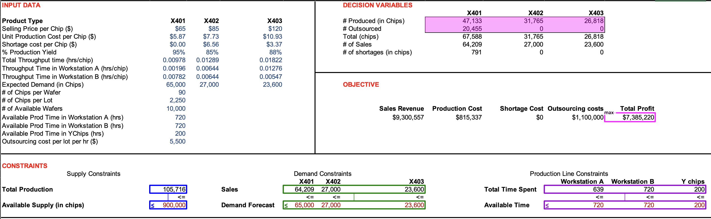
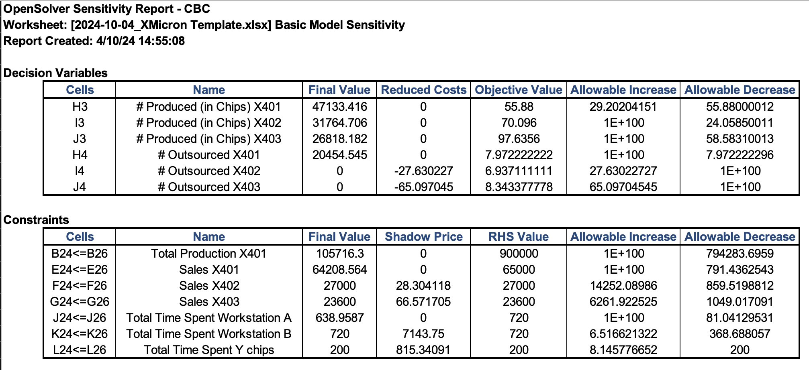

## Summary

### Background

* Semiconductor manufacturer in Silicon Valley, California

* Spent $1 billion to build its Sunnyvale plant in 1999
Amortized to be $5,000 per lot per fab hr over the expected fab life

* A semiconductor is a material that has electrical conductivity to a degree between that of a metal and that of an insulator

* Semiconductors are the foundation of modern electronics (e.g., transistors, solar cells, LEDs, etc.)

### Setup of the case

* Who?

  * Mike Morris, Chief Operating Officer
  * Kelly Klein, VP of finance
  * Warren Wong, VP of sales
  * David Dunn, VP of manufacturing

* When?

  * Monday, 31 May 2004

* What?

  * To determine the production plan for July 2004 given all available information

  * How many of which chips to produce next month?
  * Should XMicron outsource?

### Silicon wafers:

* X401
* X402
* X403

## Production Process

- **# of raw wafers for July = 10,000**
  
- **25 wafers per lot**
  
---

### Lot 1:
- **Lot throughput time:** 22 hours
- **Fabrication Facility:**
  - A (720 hrs/month)
  - B (720 hrs/month)
- **Flow:**
  - 80% to BTS
  - 20% to next facility
- **Defect Rate:** 5%
- **Output Product:** X401 
- **Forecast (July 2004):** 65,000 BTS chips

---

### Lot 2:
- **Lot throughput time:** 29 hours
- **Fabrication Facility:**
  - A (720 hrs/month)
  - B (720 hrs/month)
- **Flow:**
  - 50% to BTS
  - 50% to BTO
- **Defect Rate:** 15%
- **Output Product:** X402
- **Forecast (July 2004):** 25,000 BTO chips

---

### Lot 3:
- **Lot throughput time:** 41 hours
- **Fabrication Facility:**
  - A (720 hrs/month)
  - B (720 hrs/month)
- **Flow:**
  - 30% to BTS
  - 70% to BTO
- **Defect Rate:** 12%
- **Output Product:** X403
- **Forecast (July 2004):** 20,000 BTO chips

## BTO Sales Contract Information

- **BTO products (X402 and X403) have contractual upside flexibility requirement**:
  - A one-time option for the customer to buy an upside percentage over the baseline product order (PO).
  - Example: If a customer sends in a PO of 10,000 chips with a 20% upside flexibility plan, XMicron must deliver 12,000 chips provided the customer exercises the flexibility.

- **If XMicron does not meet the upside**, there is a hefty per-chip shortage cost to pay.

| Product   | X402  | X403  |
|-----------|-------|-------|
| **Contractual Upside**       | 10%   | 30%   |
| **Probability of Exercising Flex** | 0.80  | 0.60  |
| **Shortage Cost (per chip)** | $6.56 | $3.37 |

- **Expected demand for products with upside flex**:

| Product   | X401  | X402  | X403  |
|-----------|-------|-------|-------|
| **Demand** | 65,000 | 27,000 | 23,600 |

- **Formula Calculation**:

  - Expected demand for X402:

    25,000 $\times$ 0.2 + ((25,000 $\times$ 0.1) + 25,000) $\times$ 0.8
  
  - Expected demand for X403:

    20,000 $\times$ 0.4 + ((20,000 $\times$ 0.3) + 20,000) $\times$ 0.6

## Ychips: Additional Production Capacity

* Outsource to YChips to gain additional 200 hours of fabrication facility

* $5,500 per lot per fab hour

* Unlimited wafer supply (free)

* Flexible workstation, i.e., distinction between A and B no longer necessary

## Product Profitability

| **Product**                        | **X401**  | **X402**  | **X403**  |
|------------------------------------|-----------|-----------|-----------|
| **Selling Price (per chip)**        | $65       | $85       | $120      |
| **Variable Costs (per lot)**        |           |           |           |
| - Direct Labour                    | $8,800    | $11,600   | $16,400   |
| - Variable Overhead                | $4,400    | $5,800    | $8,200    |
| - Wafer Material                   | $10       | $10       | $10       |
| **Fab Usage Cost (per lot)**        | $110,000  | $145,000  | $205,000  |
| **Net Profit (per chip)**           | $7.36     | $0.08     | $4.04     |

Do you agree with the net profit calculations above?

| **Product**                        | **X401**  | **X402**  | **X403**  |
|------------------------------------|-----------|-----------|-----------|
| **Selling Price (per chip)**        | $65       | $85       | $120      |
| **Variable Costs (per lot)**        | **$13,200** | **$17,400** | **$24,600** |
| - Direct Labour                    | $8,800    | $11,600   | $16,400   |
| - Variable Overhead                | $4,400    | $5,800    | $8,200    |
| - Wafer Material                   | $10       | $10       | $10       |
| **Fab Usage Cost (per lot)**        | $110,000  | $145,000  | $205,000  |
| **Total Cost per chip (TC per chip)** | **$54.76**  | **$72.182** | **$102.048**  |
|   - Calculation for TC per chip    | $123,200 ÷ (25 × 90) = $54.76 | $162,400 ÷ (25 × 90) = $72.182 | $229,600 ÷ (25 × 90) = $102.048 |
| **Net Profit (per chip)**           | $7.36 ≠ $65 - $54.76 | $0.08 ≠ $85 - $72.182 | $4.04 ≠ $120 - $102.048 |

What is the problem?

* The chip can be sold only if it is a good one (selling price is per good chip)

* 25x90 is the number of chips in a lot but not necessarily all of them are good

* 25x90x(% of good chip) is the average number of good chips in a lot

| **Product**                        | **X401**  | **X402**  | **X403**  |
|------------------------------------|-----------|-----------|-----------|
| **Selling Price (per chip)**        | $65       | $85       | $120      |
| **Variable Costs (per lot)**        | **$13,200** | **$17,400** | **$24,600** |
| - Direct Labour                    | $8,800    | $11,600   | $16,400   |
| - Variable Overhead                | $4,400    | $5,800    | $8,200    |
| - Wafer Material                   | $10       | $10       | $10       |
| **Fab Usage Cost (per lot)**        | $110,000  | $145,000  | $205,000  |
| **Total Cost per chip (TC per chip)** | **$57.64**  | **$84.92** | **$115.96**  |
|   - Calculation for TC per chip    | $123,200 ÷ (25 × 90 × 0.95) = $57.64 | $162,400 ÷ (25 × 90 × 0.85) = $84.92 | $229,600 ÷ (25 × 90 × 0.88) = $115.96 |
| **Net Profit (per chip)**           | $7.36 = $65 - $57.64 | $0.08 = $85 - $84.92 | $4.04 = $120 - $115.96 |

## Suggested solutions

### Kelly

What does Kelly think XMicron should do?

* Production capacity should be allocated to three products based on their net profit margins

What is the total amount of production hours required in Workstation B under Kelly’s solution?

Do you agree with Kelly’s solution?

* Ignores upside flexibility contract for BTO products

* Ignores shortage costs

* Ignores production line constraints, e.g., Workstation B usage per month 838 hrs  is greater than 720 hrs (infeasible!!)

* Takes into account the fab usage cost which is an amortization cost

### Warren

What does Warren think XMicron should do?

* Allocates capacity based on product profitability, but also considers shortage cost and flexibility option

What is the total amount of production hours required in Workstation A under Warren’s solution?

Do you agree with Warren’s solution?

* Ignores production line constraints, e.g., workstation B usage per month 823 is greater than 720hrs (infeasible!!)

* Takes into account the fab usage cost which is an amortization cost

### David

What does David think XMicron should do?

* Similar to Warren’s heuristic but also takes into account the production line constraints for workstations (i.e., 720 hrs for each work station)

* Production line constraint for workstation B is violated when entire demand is satisfied so decrease X402 production compared to that in Warren’s solution

Do you agree with David’s solution?
Whose solution you prefer?

## Analysis

### Decision variables

How many of which chips to produce in July?

* $𝐗_𝟏$: # of X401 chips produced in house

* $𝐗_2$: # of X402 chips produced in house

* $𝐗_3$: # of X403 chips produced in house

### Solution

### Sensitivity Analysis

How much is XMicron willing to pay to increase the demand for each product by one, or to have one more wafer?

Shadow price indicates the change in the optimal value of the objective when the right side of a constraint changes by one unit

