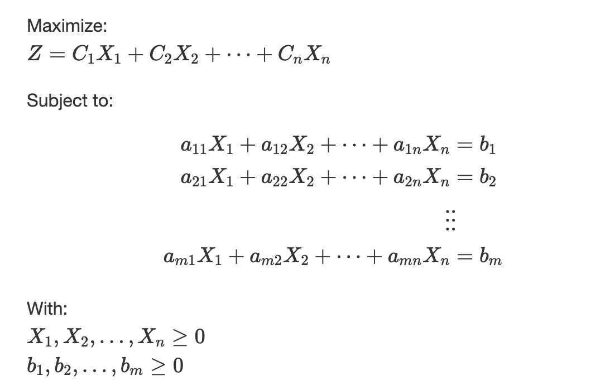
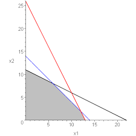

# PRESCRIPTIVE ANALYTICS: OPTIMIZING DATA-DRIVEN DECISIONS

## What is prescriptive analytics

### What is Prescriptive Analytics?

Prescriptive analytics is the branch of data analytics focused on **suggesting actions** you can take to affect desired outcomes. It builds on **descriptive analytics** (what happened) and **predictive analytics** (what could happen), but it goes a step further by prescribing specific decisions and strategies.

### Key Features

- **Optimization**: It uses mathematical models and optimization techniques to recommend the best course of action given certain constraints.
- **Simulation**: Often incorporates simulation models to understand how different actions might play out under varying scenarios.
- **Decision Making**: Helps decision-makers choose among various options based on data-driven insights.
- **Uncertainty Handling**: Prescriptive analytics can take uncertainty and risk into account to provide robust recommendations.

We will focus on the first two points, although there will be elements of all four permeating through the course.

### Techniques and Tools

- **Optimization Models**: Linear programming, integer programming, mixed-integer programming.
- **Simulation**: Monte Carlo simulations and scenario analysis.
- **Technology**: Common tools include Excel Solver, IBM CPLEX, @Risk, Gurobi, and Python libraries like `PuLP` and `SciPy`.

### Applications

- **Supply Chain Management**: Optimize inventory levels, transportation routes, and production schedules.
- **Healthcare**: Develop personalized treatment plans and optimize resource allocation.
- **Finance**: Allocate portfolios, manage risks, and optimize pricing strategies.

## Overview of the cases we will cover

| **Decision Models:**      | **Resource Allocation** (Excel Solver) | **Simulation** (@Risk) |
|---------------------------|----------------------------------------|------------------------|
| **Case #1:**               | *Red Brand Canners*                    | *Dynatron*             |
| **Case #2:**               | *XMicron*                              |                        |
| **Case-based project:**    | Report #1                              | Report #2              |

## Some real optimization use cases

* Bullet factory in Mexico
* Copper mine in Chile
* Inventory management at Amazon
* Resource allocation in Novartis

### Why does "decision science" exist at all?

- **Multiple Objectives**: Maximize potential upside, minimize risk
- **Different Alternatives**: Infinite number of potential investments
- **Sensitivity**: How sensitive is the proposed solution to changes in exogenous factors?
- **Uncertainty of Key Elements**: Volatile economy, covid pandemic, etc.

## What is the value of the techniques we will cover?

- **Objective**: Reduce risk/uncertainty in decision making using available information.
- **Prescriptive vs. Descriptive**: Not only explains why things happen but also suggests solutions/improvements.
- **More than a solution**: Provides insights into situation, uncertainty, objectives, and trade-offs.
- **Adaptability**: Easy to update when conditions change, accounts for uncertainty.
- **Support for Decision Maker**: The model yields recommended actions but should not replace the decision maker.
- **Improving decision-making skills** using decision models and technology.

> "All models are wrong, but some are useful."  
> — George E. P. Box

## Optimization

### A mathematical formulation

### Key elements:

* **The target variable**: maximize profit, minimize cost, etc.

* **Risks/Constraints**: Budget limitations, inaccurate forecasting, increased uncertainty with more risk/constraints.

---

## Red Brand Canners Case

---
